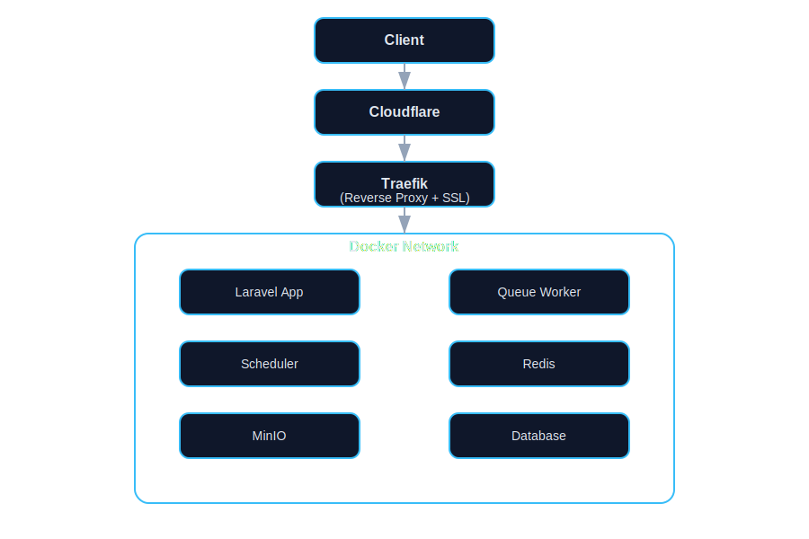

# 🛡️ Project Pentagon

**Project Pentagon** adalah arsitektur infrastruktur modern berbasis container yang dirancang untuk mendukung aplikasi Laravel dalam skala multi-service dan multi-tenant, dengan fokus pada **scalability**, **maintainability**, dan **production readiness**.

---

## 🧠 Architecture Overview

Berikut adalah gambaran alur sistem:

---

## 🚀 Core Components

### 🌐 Cloudflare
- DNS Management
- CDN & Caching
- SSL/TLS termination (optional)
- DDoS Protection

---

### 🔀 Traefik (Reverse Proxy)
- Dynamic routing berbasis container
- Automatic SSL (Let's Encrypt / Cloudflare)
- Middleware support (rate limit, auth, dll)

---

### 🐳 Docker Environment
Semua service berjalan dalam isolated container untuk konsistensi environment dan kemudahan deployment.

---

### ⚙️ Laravel Application
- Mendukung arsitektur:
  - Multi-service (modular)
  - Multi-tenant (shared / isolated)
- Terpisah antara:
  - App container
  - Queue worker
  - Scheduler

---

### 📦 Queue Worker
- Menjalankan job asynchronous
- Menggunakan Redis sebagai backend

---

### ⏱️ Scheduler
- Menjalankan cron job Laravel (`schedule:run`)
- Dipisah dari container utama untuk reliability

---

### 🗄️ Database
- Menggunakan:
  - MySQL (recommended)
  - MariaDB (optional)
- Engine:
  - InnoDB (default & production ready)

---

### 🪣 MinIO (Object Storage)
- S3-compatible storage
- Digunakan untuk:
  - File upload
  - Asset storage
  - Backup

---

### ⚡ Redis
- Cache layer
- Queue driver
- Session storage
- Performance booster untuk aplikasi

---

## 🧱 Design Principles

- **Separation of Concerns**  
  Setiap service berjalan dalam container terpisah

- **Scalability First**  
  Mudah scale horizontal (app, worker, dll)

- **Production Ready**  
  Dirancang untuk kebutuhan real-world & enterprise

- **Cloud Agnostic**  
  Bisa dijalankan di VPS, cloud, maupun hybrid

---

## ⚠️ Best Practices

- Gunakan volume untuk persistence (DB & storage)
- Pisahkan container:
  - App
  - Worker
  - Scheduler
- Aktifkan logging sejak awal
- Gunakan Redis untuk performa optimal
- Siapkan strategi backup (DB & MinIO)

---

## 📌 Roadmap (Optional)

- [ ] Database replication (master-slave)
- [ ] Horizontal scaling (multi-node)
- [ ] Observability (Prometheus, Grafana)
- [ ] Centralized logging (ELK / Loki)
- [ ] Kubernetes migration (future)

---

## 🤝 Contributing

Kontribusi terbuka untuk pengembangan arsitektur dan improvement sistem.  
Silakan buat issue atau pull request.

---

## 📄 License

MIT License
